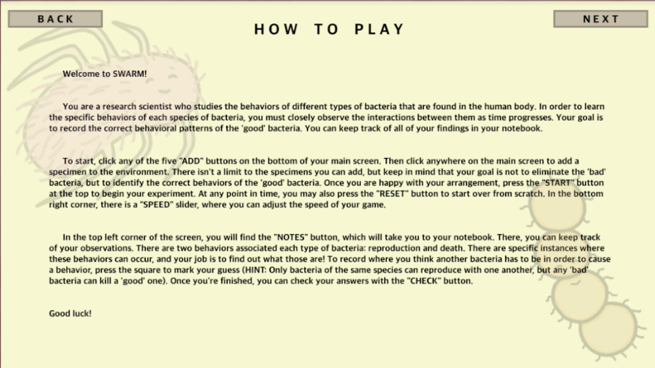

# SWARM

*Grow your own bacterial colony and see how your actions decide the fate of your swarm!*

## Overview 🦠
### Who❔
This game was built and designed by my sister (`@perfectsimulation`) and me (`@rosieblair`).

### What❔
SWARM is a game that requires players to use observation and strategy to form hypotheses on how bacteria behave. To play, the player places 'good' bacteria around the screen to their preferences. Also on the screen are randomly generated 'bad' bacteria. The ultimate goal of the game is to correctly identify the instances where each 'good' bacteria will either reproduce or die. The instances are determined by location and contact with another bacterium. To keep track of progress, a notebook feature is included along with a "check" feature that allows the player to see if they guessed correctly. Speed and reset features are also included to allow the player to control their simulations. Other included features include a bacteria species index, detailed instructions, and generation (cycle) count.

### When/Where❔
This project was created as part of HackGSU - Spring 2017. See the [DevPost page](https://devpost.com/software/swarm-ijolvg) for this project for more info.

### Why❔
There's no doubt that our future revolves around science and technology. So how do we encourage young minds to consider careers in STEM? In our strategy-based simulation game, we combined real scientific concepts with an interactive platform to inspire players to adopt unique problem-solving skills and further their own scientific knowledge.

### How❔
This game was made with [Unity](https://unity.com/) (in C#). All visual assets in the game were hand-drawn in [GIMP](https://www.gimp.org/).

## Conclusion 🦠

**First and foremost**, it is worth noting that this was not only the first Hackathon either of us has participated in &ndash; it is also the first game we worked on and created together as well. Designing games together is & always has been a dream for both of us, so this was effectively our first step in achieving that goal.

### Challenges
Before this project, we were&mdash;*and still are*&mdash;very new to game development as a whole. One of the most notable challenges we faced was learning the fundamentals & familiarizing ourselves with the Unity engine. Also, our decision to create all of the visual assets for our game from scratch definitely posed a unique and difficult challenge for us. These challenges were obviously only exacerbated the strict 24-hour completion window of this hackathon.

### Accomplishments
We successfully designed & developed a game in less than 24 hours! There were inevitably (many) roadblocks to overcome in order to implement every aspect of our game as planned.

## Screenshots 🦠

